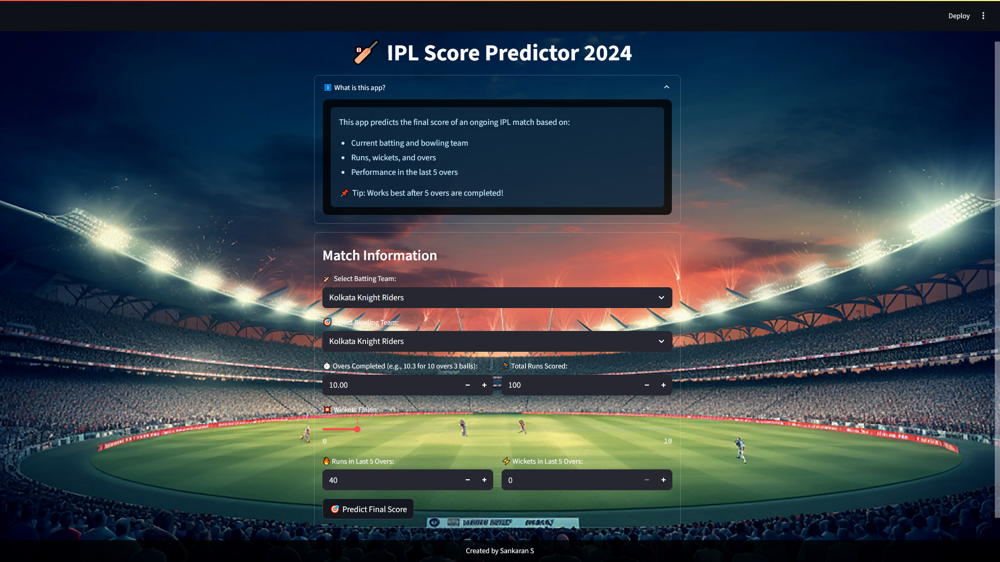

# IPL Score Predictor 2024


Predict the final score of ongoing IPL matches quickly and easily!

## ✨ Demo Screenshots



**[Live Demo - Try it here!](https://ipl-score-predictor-fsu9.onrender.com/)**

## 📊 About the Dataset

The IPL Dataset is a collection of cricket match records, designed for analysis and machine learning projects. This dataset contains:

- **Match Details:** Match ID, date, and venue.
- **Team Names:** Batting and bowling teams.
- **Player Info:** Batsman and bowler names.
- **Performance Stats:** Runs, wickets, and overs.

**File used:** `IPL_Dataset.csv`
**Format:** CSV (Comma-separated values)

**Columns included:**


| Column | Description |
| :-- | :-- |
| mid | Match ID |
| date | Date of match |
| venue | Venue of match |
| bat_team | Batting team name |
| bowl_team | Bowling team name |
| batsman | Name of batsman |
| bowler | Name of bowler |
| runs | Runs scored (by this batsman) |
| wickets | Wickets taken (by this bowler) |
| overs | Overs bowled |

## 🏏 About the App

This web app predicts the *final score* of an ongoing IPL match based on current match stats.

**Features:**

- Simple and beginner-friendly interface.
- Choose batting and bowling teams.
- Enter current runs, wickets, and overs.
- Include runs and wickets in the last 5 overs.
- Instant final score prediction.

## 🚦 How to Use

1. **Select Teams:** Choose the batting and bowling teams from dropdowns.
2. **Enter Match Info:**
    - Overs completed (e.g., *10.3* for 10 overs and 3 balls)
    - Total runs scored so far
    - Total wickets fallen
    - Runs scored in the last 5 overs
    - Wickets fallen in the last 5 overs
3. **Predict:** Click “🎯 Predict Final Score”
The app will show the predicted final score range instantly!

**Pro tip:** For best results, use after 5 overs are completed.

## 🏆 How the Prediction Works

- The app uses a **Random Forest Regressor (RFR)** model.
- This model beat other algorithms with the highest score in training.
- The RFR uses selected features to provide accurate, real-time predictions.


## 🖥️ How to Run Locally

**Requirements:**

- Python 3.x
- Streamlit
- numpy, scikit-learn, pickle

**Steps:**

1. Clone the repo or download the files (`app.py`, `rfr_model.pkl`, `background.png`, `IPL_Dataset.csv`).
2. Install Streamlit and other packages:

```bash
pip install streamlit numpy scikit-learn
```

3. Run the app:

```bash
streamlit run app.py
```

4. The web app opens in your browser — ready to use!

## 📂 File Structure

```
├── ipl_score_predictor.py  # Main app code
├── rfr_model.pkl           # Machine learning model (Random Forest)
├── ipl_data.csv            # IPL match data
├── background.png          # Background image for app UI
├── app_screenshot.png
├── IPL_Score_Predictor.ipynb  
```


## 💡 Why This Project?

- Real-world use of data science and cricket analytics
- Usable by anyone, not just programmers
- Demonstrates model building, feature engineering, and deployment
- Clean, modern UI — professional and beginner-friendly


## 👤 Author

Developed by **Sankaran S**
 
[](https://github.com/sankaran-s2001)  [](https://www.linkedin.com/in/sankaran-s21/)  [](mailto:sankaran121101@gmail.com)

*If you like this project, please ⭐ the repo!*

*This project is for learning and demonstration. Data sourced from Kaggle’s [IPL Dataset](https://www.kaggle.com/datasets/umairziact/ipl-dataset)[^1].*

<div style="text-align: center">⁂</div>

[^1]: https://www.kaggle.com/datasets/umairziact/ipl-dataset

